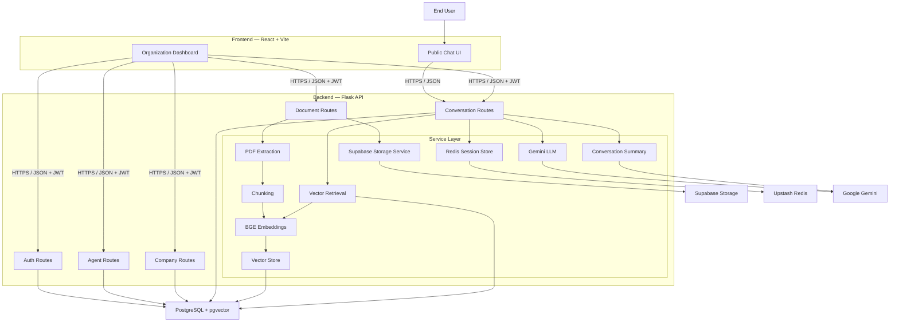
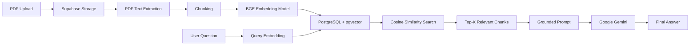
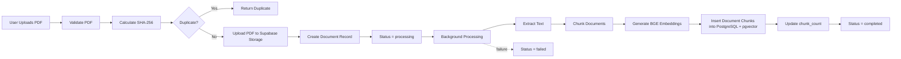
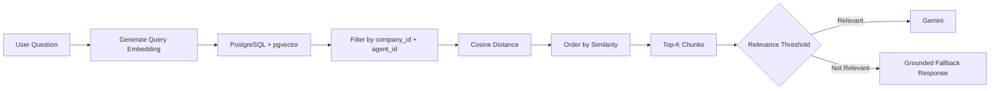
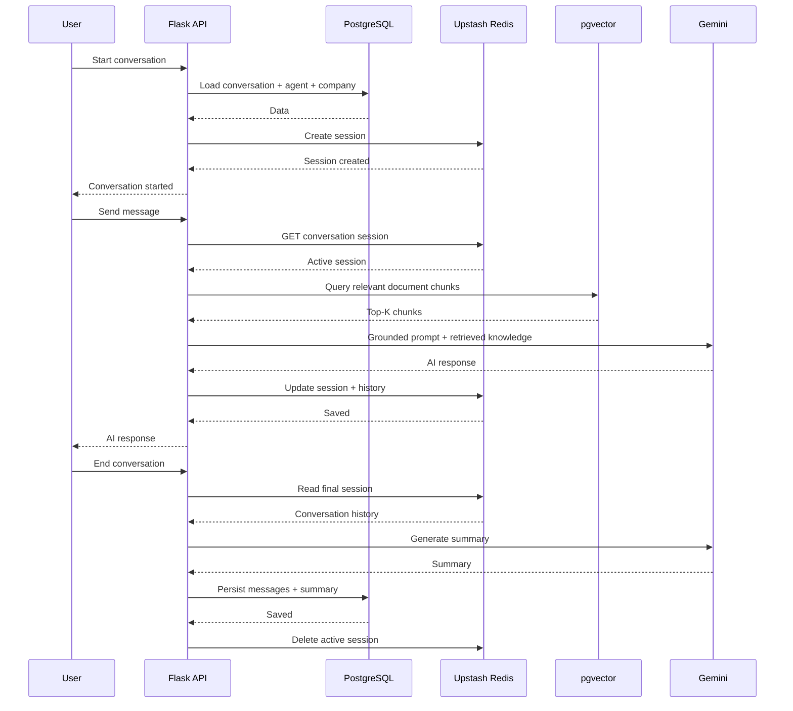
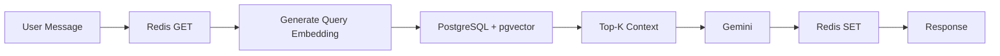

# CALL.E

CALL.E is a platform for creating and chatting with AI knowledge agents.

An organization can create an AI agent, define its purpose and organizational information, and upload PDF documents that become the agent's private knowledge base. Users can then select an agent and chat with it.

CALL.E uses a Retrieval-Augmented Generation (RAG) pipeline where:

- PDFs are stored in Supabase Storage.
- PDF text is extracted and split into chunks.
- Chunks are converted into embeddings using `BAAI/bge-base-en-v1.5`.
- Embeddings and chunk text are stored in PostgreSQL using `pgvector`.
- Relevant chunks are retrieved using cosine similarity.
- Google Gemini generates the final response using retrieved knowledge, configured organization information, and conversation history.
- Redis stores the active conversation session so normal chat messages do not need to repeatedly load conversation state from PostgreSQL.

The system is designed as a multi-tenant platform where organization, agent, document, and conversation data remain isolated.

---

# 🌟 Key Features

- **📚 Per-agent knowledge base**  
  Upload PDF documents for an agent. Documents are chunked, embedded, and stored in PostgreSQL + pgvector with `company_id`, `agent_id`, and `document_id` isolation.

- **🎯 Grounded AI responses**  
  The agent answers using retrieved document knowledge, configured organization information, and conversation history.

- **🧠 RAG with pgvector**  
  Query embeddings are compared against stored document embeddings using PostgreSQL cosine similarity search.

- **⚡ Fast active sessions with Redis**  
  Active conversation state is kept in Upstash Redis, avoiding repeated PostgreSQL conversation queries during normal chat.

- **🏢 Multi-tenant architecture**  
  Multiple organizations can create multiple agents, documents, and conversations while keeping knowledge scoped by organization and agent.

- **📄 Async PDF processing**  
  PDF processing happens in a background thread so upload requests return quickly while extraction, chunking, embedding, and vector insertion continue asynchronously.

- **🔁 Document reprocessing**  
  Existing PDFs can be reprocessed from Supabase Storage.

- **🗑️ Document deletion**  
  Deleting a document removes its stored PDF and associated pgvector chunks.

- **🔐 JWT authentication**  
  Organization management routes are protected using JWT authentication.

- **📊 Organization dashboard**  
  Manage agents, documents, and conversations from a centralized dashboard.

- **💬 Public AI-agent chat**  
  End users can browse active agents and start conversations without creating an organization account.

---

# 🏗️ System Architecture

## High-Level Architecture



---

# 🔄 RAG Architecture

The knowledge pipeline uses PostgreSQL + pgvector.



The vector database is not a collection of local FAISS files.

Document chunks and their 768-dimensional embeddings are stored directly in PostgreSQL using pgvector.

---

# 🗄️ Database Schema

CALL.E uses PostgreSQL as the permanent data store.

The main application tables are:

- `companies`
- `agents`
- `documents`
- `document_chunks`
- `conversations`
- `messages`

## Entity Relationship Diagram


> Place the database diagram image in the repository root using the filename:
>
> `Database Schema & Relationships Diagram.png`

### Core Relationships

```text
Company
 ├── has many Agents
 ├── has many Documents
 └── has many Conversations

Agent
 ├── belongs to Company
 ├── has many Documents
 └── has many Conversations

Document
 ├── belongs to Company
 ├── belongs to Agent
 └── has many DocumentChunks

DocumentChunk
 ├── belongs to Document
 ├── stores company_id
 ├── stores agent_id
 └── stores 768-dimensional embedding

Conversation
 ├── belongs to Company
 ├── belongs to Agent
 └── has many Messages

Message
 └── belongs to Conversation
```

## Main Tables

| Table | Purpose |
|---|---|
| `companies` | Organization accounts and authentication information |
| `agents` | AI agent identity, role, objective, organization information, and purpose |
| `documents` | Uploaded PDF metadata, hash, processing status, and storage information |
| `document_chunks` | Chunked document text plus 768-dimensional pgvector embeddings |
| `conversations` | Conversation metadata and lifecycle information |
| `messages` | Persisted user, assistant, and system messages |

---

## `document_chunks`

The `document_chunks` table is the core of the RAG database.

Important columns:

```text
id            BIGINT
company_id    INTEGER
agent_id      INTEGER
document_id   INTEGER
chunk_index   INTEGER
chunk_text    TEXT
embedding     VECTOR(768)
created_at    TIMESTAMP
```

The embedding model currently used by the application is:

```text
BAAI/bge-base-en-v1.5
```

Embedding dimension:

```text
768
```

---

# 📚 Document Processing Pipeline

A document uploaded through the dashboard follows this pipeline:



## Processing Steps

### 1. PDF Validation

Only PDF uploads are accepted.

The application validates:

```text
.pdf extension
+
application/pdf MIME type
```

### 2. Duplicate Detection

A SHA-256 hash of the uploaded file is generated.

The system checks whether the same completed document already exists for the same agent.

This prevents accidental duplicate ingestion.

### 3. Supabase Storage

The original PDF is stored in Supabase Storage.

The storage path follows the organization and agent structure:

```text
company_<company_id>/agent_<agent_id>/<stored_filename>
```

### 4. PDF Extraction

Text is extracted from the PDF.

### 5. Chunking

The extracted text is split into smaller chunks.

Default configuration:

```env
CHUNK_SIZE=500
CHUNK_OVERLAP=50
```

The overlap helps preserve context across chunk boundaries.

### 6. Embedding Generation

Every chunk is converted into a vector using:

```text
BAAI/bge-base-en-v1.5
```

Embeddings are normalized before storage.

### 7. pgvector Storage

Each chunk is stored in:

```text
document_chunks
```

along with:

```text
company_id
agent_id
document_id
chunk_index
chunk_text
embedding
```

---

# 🔎 Retrieval Pipeline

When a user asks a question:



The retrieval query is scoped by:

```text
company_id
+
agent_id
```

This ensures that one agent does not retrieve chunks belonging to another agent.

Current retrieval configuration:

```env
RAG_TOP_K=4
RAG_RELEVANCE_THRESHOLD=0.48
```

Similarity is calculated from PostgreSQL cosine distance:

```text
similarity = 1 - cosine_distance
```

---

# 🤖 LLM Layer

Google Gemini is used for response generation.

The application calls Gemini through the configured LLM service.

The retrieved document context, organization information, conversation history, and current user question are passed into the grounded prompt.

## Grounding Rules

The agent is instructed to:

1. Answer only from retrieved knowledge, organization information, and conversation history.
2. Treat retrieved organization knowledge as authoritative.
3. Never fill missing information using unsupported knowledge.
4. Never guess organization-specific URLs, phone numbers, addresses, IDs, dates, deadlines, amounts, eligibility rules, procedures, or policies.
5. Explicitly say when the available knowledge does not contain enough information.
6. Avoid unsupported recommendations or next steps.
7. Avoid inventing personal information.
8. Distinguish document information from information requiring external or personal data.
9. Remain grounded even when a question is related to the organization's domain.
10. Provide only the supported part of a partially answerable question.
11. Avoid exposing internal implementation details.
12. Stay within the agent's configured purpose.
13. Redirect unrelated questions back to the agent's supported scope.
14. Keep responses concise and natural.
15. Treat missing information as meaningful instead of guessing.

---

# 💬 Conversation Architecture

An active conversation uses Redis as its temporary session store.



## Session Lifecycle

### Start Conversation

Loads the required conversation, agent, and company information from PostgreSQL and creates a Redis session.

### Send Message

Reads the active session from Redis.

Then:

```text
Redis
  ↓
Query Embedding
  ↓
pgvector Retrieval
  ↓
Grounded Prompt
  ↓
Gemini
  ↓
Redis Update
  ↓
Response
```

Normal message handling does not need to reconstruct the conversation from PostgreSQL.

### End Conversation

The final Redis session is read, persisted to PostgreSQL, summarized, and then removed from Redis.

PostgreSQL remains the permanent source of record.

---

# 🌐 API Structure

## Authentication

```text
POST /api/auth/register
POST /api/auth/login
GET  /api/auth/me
```

## Agents

```text
POST  /api/agents
GET   /api/agents
PATCH /api/agents/:id

GET   /api/agents/public
GET   /api/agents/public/:id
```

## Documents

```text
POST   /api/documents/upload
GET    /api/documents
DELETE /api/documents/:id
POST   /api/documents/:id/reprocess
```

## Conversations

```text
POST /api/conversations
POST /api/conversations/:id/start
POST /api/conversations/:id/message
POST /api/conversations/:id/end

GET /api/conversations
GET /api/conversations/:id
```

## Company

```text
GET /api/company/dashboard
```

Organization management endpoints use JWT authentication.

---

# 🖥️ Frontend

The frontend is built with:

- React 18
- Vite
- Tailwind CSS
- React Router
- Framer Motion
- Axios
- React Hot Toast
- React Toastify
- Lucide React

## Main Routes

| Route | Purpose |
|---|---|
| `/` | Landing page |
| `/user` | Browse active agents |
| `/user/agent/:agentId` | View agent information |
| `/user/conversation/:id` | Public chat interface |
| `/company/login` | Organization login |
| `/company/register` | Organization registration |
| `/company/onboarding` | Create agent and upload documents |
| `/company/dashboard` | Manage agents and documents |
| `/company/conversations` | View conversations |
| `/company/conversations/:id` | View conversation details |

---

# 📂 Project Structure

```text
CALL.E/
│
├── backend/
│   ├── app.py
│   ├── config.py
│   ├── gunicorn.conf.py
│   ├── Procfile
│   ├── requirements.txt
│   │
│   ├── models/
│   │   ├── __init__.py
│   │   ├── company.py
│   │   ├── agent.py
│   │   ├── document.py
│   │   ├── document_chunk.py
│   │   └── conversation.py
│   │
│   ├── routes/
│   │   ├── auth.py
│   │   ├── agent.py
│   │   ├── company.py
│   │   ├── documents.py
│   │   └── conversations.py
│   │
│   ├── services/
│   │   ├── embeddings.py
│   │   ├── chunking.py
│   │   ├── pdf_text.py
│   │   ├── vector_store.py
│   │   ├── retrieval.py
│   │   ├── llm.py
│   │   ├── conversation_service.py
│   │   ├── summary.py
│   │   ├── session_store.py
│   │   └── supabase_storage.py
│   │
│   └── utils/
│       ├── auth.py
│       └── files.py
│
├── frontend/
│   ├── package.json
│   ├── vite.config.js
│   └── src/
│       ├── api/
│       ├── components/
│       ├── context/
│       ├── pages/
│       └── ...
│
├── Database Schema & Relationships Diagram(1).png
│
└── README.md
```

---

# 🛠️ Tech Stack

| Layer | Technology |
|---|---|
| Frontend | React 18, Vite |
| Styling | Tailwind CSS |
| Animation | Framer Motion |
| Routing | React Router |
| HTTP Client | Axios |
| Backend | Flask |
| ORM | Flask-SQLAlchemy |
| Authentication | Flask-JWT-Extended |
| Database | PostgreSQL |
| Vector Database | pgvector |
| PDF Processing | pypdf |
| Chunking | LangChain text utilities |
| Embeddings | `BAAI/bge-base-en-v1.5` |
| LLM | Google Gemini |
| Session Store | Upstash Redis |
| File Storage | Supabase Storage |
| Production Server | Gunicorn |
| Containerization | Docker |
| Deployment | Cloud/Docker compatible |

---

# ⚙️ Configuration

The backend reads environment variables from:

```text
backend/.env
```

Example:

```env
# Database
DATABASE_URL=postgresql://...

# JWT
JWT_SECRET_KEY=your-secret-key

# Supabase
SUPABASE_URL=https://your-project.supabase.co
SUPABASE_KEY=your-service-role-key
SUPABASE_STORAGE_BUCKET=documents

# Embeddings
EMBEDDING_MODEL_NAME=BAAI/bge-base-en-v1.5

# RAG
RAG_TOP_K=4
RAG_RELEVANCE_THRESHOLD=0.48
CHUNK_SIZE=500
CHUNK_OVERLAP=50

# Gemini
GEMINI_API_KEY=...
GEMINI_API_KEY_1=...
GEMINI_API_KEY_2=...
GEMINI_MODEL=gemini-3.5-flash-lite

# Redis
UPSTASH_REDIS_REST_URL=https://...
UPSTASH_REDIS_REST_TOKEN=...

# Conversation
CONVERSATION_INACTIVITY_TIMEOUT_SECONDS=900

# Frontend
FRONTEND_ORIGINS=http://localhost:5173

# Server
PORT=5000
```

---

# 🚀 Getting Started

## Prerequisites

Install:

- Python 3.12+
- Node.js 18+
- PostgreSQL / Supabase
- Supabase Storage
- Upstash Redis
- Google Gemini API key

---

## 1. Clone the Repository

```bash
git clone https://github.com/probin-dhakal/call-e-chatbot.git
cd call-e-chatbot
```

---

## 2. Backend Setup

```bash
cd backend

python3 -m venv venv
source venv/bin/activate
```

Windows:

```bash
venv\Scripts\activate
```

Install dependencies:

```bash
pip install -r requirements.txt
```

---

## 3. Configure Environment Variables

Create:

```text
backend/.env
```

Add your:

- PostgreSQL connection string
- JWT secret
- Supabase credentials
- Gemini API key(s)
- Upstash Redis credentials
- Frontend origin

---

## 4. Frontend Setup

Open another terminal:

```bash
cd frontend
npm install
```

---

# ▶️ Running Locally

## Start Backend

```bash
cd backend
source venv/bin/activate
python app.py
```

Backend:

```text
http://127.0.0.1:5000
```

## Start Frontend

```bash
cd frontend
npm run dev
```

Frontend:

```text
http://localhost:5173
```

---

# 🐳 Docker

The backend includes a Dockerfile for containerized deployment.

Build:

```bash
cd backend
docker build -t call-e-backend .
```

Run:

```bash
docker run -p 5000:5000 --env-file .env call-e-backend
```

The embedding model can be loaded into the container so the application does not need to download the model repeatedly after startup.

Because vectors are stored in PostgreSQL + pgvector, the application does not require a local FAISS index volume.

---

# ☁️ Production Deployment

The backend uses Gunicorn in production.

Example:

```bash
cd backend
gunicorn -c gunicorn.conf.py app:app
```

The frontend can be deployed as a Vite application on platforms such as Vercel.

The backend can be deployed using Docker or a Python-compatible cloud service.

---

# 🔐 Multi-Tenant Data Isolation

CALL.E is designed around organization and agent scoping.

Document chunks contain:

```text
company_id
agent_id
document_id
```

Retrieval filters by both:

```text
company_id
+
agent_id
```

Therefore, a query for one agent only searches the knowledge associated with that organization and agent.

The backend also derives the authenticated organization from the JWT rather than trusting a client-provided `company_id`.

---

# 📄 Document Lifecycle

Documents move through the following states:

```text
uploaded
   ↓
processing
   ↓
completed
```

If processing fails:

```text
processing
   ↓
failed
```

The document record stores information including:

```text
file_hash
status
error_message
embedding_model
chunk_count
uploaded_at
```

---

# 🔁 Reprocessing

Existing documents can be reprocessed using:

```text
POST /api/documents/:id/reprocess
```

The original PDF is downloaded from Supabase Storage and sent through the ingestion pipeline again.

The frontend provides a reprocess action for documents that are in `completed` or `failed` states.

---

# 🗑️ Document Deletion

Deleting a document performs the following operations:

```text
1. Remove document chunks from PostgreSQL
2. Remove the original PDF from Supabase Storage
3. Remove the document record
```

---

# 🧠 Embedding Model

CALL.E currently uses:

```text
BAAI/bge-base-en-v1.5
```

Configuration:

```text
Embedding dimension: 768
Normalization: enabled
```

The application caches the embedding model at the process level and protects first-time initialization using a thread lock.

---

# 📈 Performance Architecture

The application separates permanent data from short-lived conversation state.

```text
Permanent Data
     │
     └── PostgreSQL
          ├── companies
          ├── agents
          ├── documents
          ├── document_chunks
          ├── conversations
          └── messages

Temporary Active-Session Data
     │
     └── Redis
          └── conversation:<id>
```

The main chat path is:



This avoids loading a local vector index from disk for each chat request and keeps vector search inside the PostgreSQL data layer.

---

# 🛡️ Reliability Features

The project includes several defensive mechanisms:

- JWT-protected organization APIs
- Organization-scoped database queries
- SHA-256 document deduplication
- Background document processing
- Document processing status tracking
- Document error reporting
- Redis session TTL
- Redis session error handling
- Gemini API-key rotation and retry logic
- Thread-safe embedding model initialization
- CORS configuration
- Private Supabase Storage for uploaded PDFs

---

# 🔭 Future Improvements

Possible future improvements include:

- PostgreSQL vector index tuning such as HNSW for larger knowledge bases
- Safer transactional document reprocessing
- Backend locking for simultaneous reprocess requests
- Background job workers instead of in-process Python threads
- Better document versioning
- Streaming Gemini responses
- RAG evaluation datasets and automated retrieval benchmarks
- Observability and metrics
- Rate limiting
- More advanced document parsers for tables and scanned PDFs

---

# 📌 Important Architectural Notes

### PostgreSQL is the permanent source of truth

PostgreSQL stores:

```text
Companies
Agents
Documents
Document Chunks
Conversations
Messages
```

### Supabase Storage stores the original PDFs

The PDFs themselves are not stored inside PostgreSQL.

### pgvector stores embeddings

Embeddings are stored directly inside:

```text
document_chunks.embedding
```

using:

```text
VECTOR(768)
```

### Redis is temporary session state

Redis stores active conversations while they are in progress.

It is not the permanent source of truth.

### Gemini generates the final answer

Gemini receives the retrieved context and generates the response under the application's grounding rules.

---

# 📜 License

This project is intended for educational, experimental, and development purposes.

---

# 👨‍💻 Author

**Probin Dhakal**

GitHub:

https://github.com/probin-dhakal

Repository:

https://github.com/probin-dhakal/call-e-chatbot

---

# ⭐ CALL.E

CALL.E combines:

```text
React
   +
Flask
   +
PostgreSQL
   +
pgvector
   +
Redis
   +
Supabase Storage
   +
BGE Embeddings
   +
Google Gemini
```

to provide a document-grounded AI knowledge-agent platform.