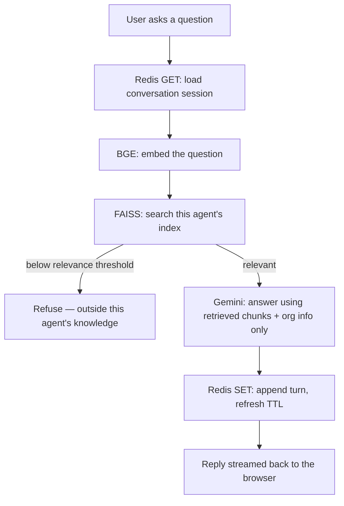

CALL.E is a platform for creating and chatting with AI knowledge agents. An organization signs up, creates an agent (name, role, purpose, organization info), and uploads its PDFs — those documents are chunked and embedded into a private, per-agent knowledge base. Anyone can then browse active agents and ask them questions; every answer is grounded strictly in that agent's retrieved knowledge, never the model's general knowledge.

---

## 🌟 Key Features
- **📚 Per-agent knowledge base:** Upload PDFs, they're chunked and embedded into an isolated FAISS index — one agent's knowledge never leaks into another's
- **🎯 Strictly grounded answers:** The agent answers only from retrieved knowledge + its configured organization info, explicitly says when the knowledge base doesn't cover something, and never fabricates facts (dates, IDs, contact info, procedures) to fill a gap
- **💬 Real-time chat UI:** Text conversation with a typewriter reveal, no mic/voice required
- **🏢 Multi-tenant by design:** Any number of organizations, each with any number of agents, each with its own isolated documents and conversations
- **📊 Organization dashboard:** Manage agents, documents, and review past conversations with auto-generated summaries

---

## 🛠️ Tech Stack
| Layer                 | Technology                                                        |
|------------------------|--------------------------------------------------------------------|
| **Frontend**           | React 18 + Vite, Tailwind CSS v4, Framer Motion                    |
| **Backend**            | Flask (Python), served by Gunicorn in production                   |
| **Database**           | PostgreSQL (Supabase)                                              |
| **File storage**       | Supabase Storage (private bucket for uploaded PDFs)                |
| **LLM**                | Google Gemini, via the `google-genai` SDK directly (no LangChain)  |
| **Embeddings**         | `BAAI/bge-base-en-v1.5` via `sentence-transformers`                |
| **Vector search**      | FAISS (`IndexFlatIP`), one index per agent                         |
| **Session cache**      | Upstash Redis — holds the active conversation, not Postgres        |

---

## 🧠 How a Chat Works


Postgres is the permanent record, but it's deliberately **not** touched during an active chat — the conversation lives entirely in Redis from `/start` until `/end`, at which point its full history and an auto-generated summary are persisted and the Redis key is cleared. This keeps `/message` fast: no Postgres round-trips on the hot path.

Key endpoints (see `backend/routes/`):
- `POST /api/conversations` — start a new conversation with an agent
- `POST /api/conversations/<id>/start` — get the agent's opening line, builds the Redis session
- `POST /api/conversations/<id>/message` — ask a question, get a grounded answer
- `POST /api/conversations/<id>/end` — end the chat, persist it to Postgres
- `POST /api/documents/upload` — upload PDFs for an agent (JWT-authenticated)
- `GET /api/agents/public` — browse active agents (no account needed)

---

## 🚀 Getting Started

### Prerequisites
- Python 3.12+
- Node.js 18+
- A [Google Gemini API key](https://aistudio.google.com/apikey)
- A [Supabase](https://supabase.com/) project (Postgres + Storage)
- An [Upstash Redis](https://upstash.com/) database (REST API)

### Installation
```bash
# Clone repository
git clone https://github.com/yourusername/CALL.E.git
cd CALL.E

# Backend setup
cd backend
python3 -m venv venv
source venv/bin/activate      # Windows: venv\Scripts\activate
pip install -r requirements.txt

# Frontend setup
cd ../frontend
npm install
```

### ⚙️ Configuration
In `backend/`, copy `.env.example` to `.env` and fill in your keys:
```sh
cp .env.example .env
```
See `.env.example` for the full list (Gemini, Supabase, Upstash Redis, JWT secret, RAG tuning) and what each one is for.

### ▶️ Running it
```bash
# Terminal 1 — backend (http://127.0.0.1:5000)
cd backend
source venv/bin/activate
python app.py

# Terminal 2 — frontend (http://localhost:5173)
cd frontend
npm run dev
```
Open `http://localhost:5173` — browse agents as a user, or create an organization account to build your own.

**Production:** `python app.py` runs Flask's own dev server — fine locally, not for deployment. Use Gunicorn instead:
```bash
cd backend
gunicorn -c gunicorn.conf.py app:app
```
`gunicorn.conf.py` runs 2 worker processes × 4 threads each (`gthread` worker class — the default `sync` worker ignores `--threads` entirely) with a 120s request timeout, since Gemini replies can take several seconds. Platforms that look for a `Procfile` (Heroku, Render, Railway) will pick this up automatically from `backend/Procfile`.

---

## 📂 Project Structure
```
CALL.E/
├── backend/
│   ├── app.py                    # Flask app factory
│   ├── config.py                 # All environment-driven config
│   ├── gunicorn.conf.py          # Production server config
│   ├── models/                   # SQLAlchemy models: Company, Agent, Document, Conversation
│   ├── routes/                   # Blueprints: auth, agent, documents, conversations, company
│   ├── services/
│   │   ├── embeddings.py         # BGE embedding model (singleton, thread-safe)
│   │   ├── chunking.py           # PDF text chunker
│   │   ├── vector_store.py       # Per-agent FAISS index read/write
│   │   ├── retrieval.py          # Search + relevance gate
│   │   ├── llm.py                # Gemini client, multi-key rotation
│   │   ├── conversation_service.py  # Grounded prompt + reply generation
│   │   ├── summary.py            # End-of-chat summary generation
│   │   ├── session_store.py      # Redis session cache
│   │   └── supabase_storage.py   # PDF upload/download to Supabase Storage
│   └── vector_embedding/         # FAISS indices, one per agent (gitignored)
└── frontend/
    └── src/
        ├── pages/                # FrontPage, UserWelcome, AgentDetail, Conversation, company/*
        ├── components/           # Navbar, ProtectedRoute, FormField
        ├── context/              # AuthContext (JWT)
        └── api/                  # REST client modules
```

---

## Conclusion
CALL.E is a RAG-grounded knowledge chatbot platform: any organization can stand up an agent scoped to its own documents, and every answer it gives is traceable back to that knowledge base — never invented, never borrowed from the model's general knowledge.
