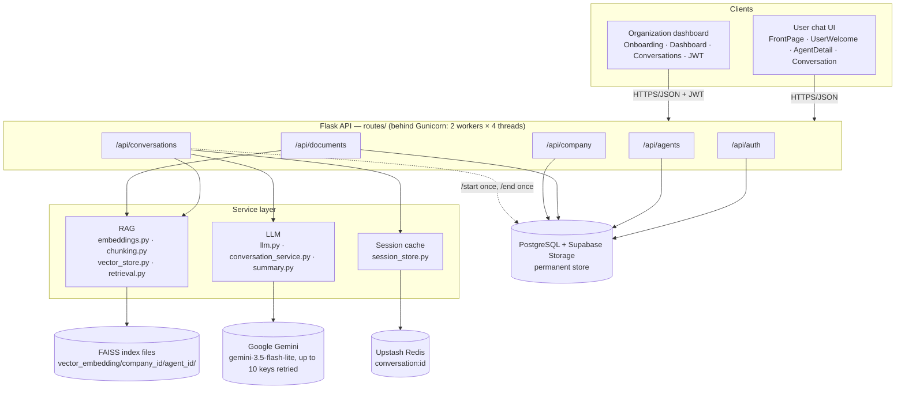
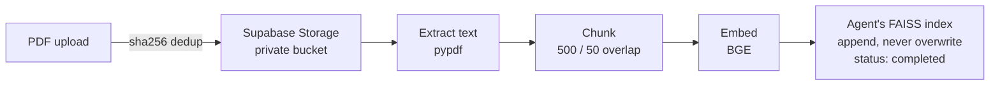
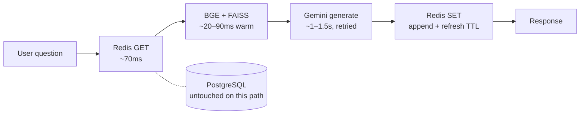

CALL.E is a platform for creating and chatting with AI knowledge agents. An organization signs up, creates an agent (name, role, purpose, organization info), and uploads its PDFs — those documents are chunked and embedded into a private, per-agent knowledge base. A user picks that agent and chats with it by typing. Every answer is grounded strictly in what the index retrieves plus the organization's own stated information, under 15 explicit anti-fabrication rules. Postgres is the permanent record; Redis holds only the conversation currently in progress; Gunicorn serves it all in production.

---

## 🌟 Key Features
- **📚 Per-agent knowledge base:** Upload PDFs, they're chunked and embedded into an isolated FAISS index — one agent's knowledge never leaks into another's
- **🎯 Strictly grounded answers:** The agent answers only from retrieved knowledge + its configured organization info, explicitly says when the knowledge base doesn't cover something, and never fabricates facts (dates, IDs, contact info, procedures) to fill a gap
- **💬 Real-time chat UI:** Text conversation with a typewriter reveal
- **🏢 Multi-tenant by design:** Any number of organizations, each with any number of agents, each with its own isolated documents and conversations
- **📊 Organization dashboard:** Manage agents, documents, and review past conversations with auto-generated summaries
- **⚡ Redis-backed active sessions:** A live conversation runs entirely off Redis — Postgres is touched once at the start and once at the end, not on every message

---

## 🛠️ Tech Stack
| Layer                 | Technology                                                        |
|------------------------|--------------------------------------------------------------------|
| **Frontend**           | React 18 + Vite, Tailwind CSS v4, React Router, Framer Motion      |
| **Backend**            | Flask (Python), served by Gunicorn in production                   |
| **Database**           | PostgreSQL (Supabase)                                              |
| **File storage**       | Supabase Storage (private bucket for uploaded PDFs)                |
| **LLM**                | Google Gemini, via the `google-genai` SDK directly (no LangChain)  |
| **Embeddings**         | `BAAI/bge-base-en-v1.5` via `sentence-transformers`                |
| **Vector search**      | FAISS (`IndexFlatIP`), one index per agent                         |
| **Session cache**      | Upstash Redis — holds the active conversation, not Postgres        |

---

## 01 · Full System Map



Requests flow top to bottom. Every service is reachable from the API layer above it; only the store beneath a service is the one it actually talks to — the RAG layer never touches Postgres, and the LLM layer never touches FAISS files directly.

---

## 02 · Frontend

React 18 + Vite, Tailwind CSS v4, React Router, Framer Motion. Two audiences share one app: anonymous end users chatting with agents, and authenticated organizations managing them.

| Route | Component | Audience | Purpose |
|---|---|---|---|
| `/` | **FrontPage** | Public | Landing page, entry points to both audiences. |
| `/user` | **UserWelcome** | Public | Browse active agents (`GET /api/agents/public`). |
| `/user/agent/:agentId` | **AgentDetail** | Public | Agent profile; "Start Chat" creates a conversation row. |
| `/user/conversation/:id` | **Conversation** | Public | Chat UI — message bubbles, typewriter reveal, text input only. |
| `/company/login` · `/register` | **Login / Register** | Org | JWT auth, token kept in `localStorage`. |
| `/company/onboarding` | **Onboarding** | Org, protected | Create an agent + upload its first PDFs in one form. |
| `/company/dashboard` | **Dashboard** | Org, protected | Agents, documents, recent conversations at a glance. |
| `/company/conversations[/:id]` | **Conversations / Detail** | Org, protected | Full conversation list + transcript + summary. |

**Support layer:**
- `context/AuthContext.jsx` — bootstraps from a stored JWT via `GET /me` on load; exposes `login/register/logout`.
- `components/ProtectedRoute.jsx` — redirects to login when `isAuthenticated` is false.
- `api/*.js` — one module per resource over a shared Axios instance (`api/axios.js`) that attaches the JWT.

---

## 03 · Backend / API

Flask app factory (`app.py`) registers five blueprints and creates tables on boot. Every route that acts on behalf of an organization requires a JWT; every route a chatting end user hits is intentionally public — there's no user account in this system, only agents and conversations.

| Blueprint | Prefix | Auth | Endpoints |
|---|---|---|---|
| auth | `/api/auth` | — | `POST /register`, `POST /login`, `GET /me` (JWT) |
| agent | `/api/agents` | Mixed | `POST /`, `GET /`, `PATCH /:id` (JWT) · `GET /public`, `GET /public/:id` (open) |
| documents | `/api/documents` | JWT | `POST /upload`, `GET /`, `DELETE /:id`, `POST /:id/reprocess` |
| conversations | `/api/conversations` | Mixed | `POST /`, `POST /:id/start`, `POST /:id/message`, `POST /:id/end` (open) · `GET /`, `GET /:id` (JWT) |
| company | `/api/company` | JWT | `GET /dashboard` |

`utils/auth.py`'s `get_current_company()` is the only source of truth for "who is calling" — routes never trust a client-supplied `company_id`.

---

## 04 · Data Model

Four tables in Postgres. `Conversation.stage` and `lead_status` are historical column names from before the sales-agent → knowledge-agent pivot — kept to avoid a migration, now holding generic values (see [Dormant & removed](#13--dormant--removed)).

| Table | Key columns | Notes |
|---|---|---|
| `companies` | `id, name, email (unique), password_hash` | An organization account. |
| `agents` | `id, company_id → companies, name, role, objective, organization_values, conversation_purpose, is_active` | One agent's identity + knowledge scope, entirely free text. |
| `documents` | `id, company_id, agent_id, file_hash (dedup), status, vector_path, chunk_count` | `status`: uploaded → processing → completed \| failed. |
| `conversations` | `id (uuid), company_id, agent_id, status, stage, summary (json), sentiment, lead_status` | `status`: active \| completed. Messages only land here at `/end` — see [Session cache](#07--session-cache). |
| `messages` | `id, conversation_id → conversations, role, content, created_at` | role: user \| assistant \| system. |

---

## 05 · RAG Pipeline

Every agent's knowledge lives in its own FAISS index on disk — never merged, never shared. Retrieval never talks to the LLM; the LLM never talks to FAISS. `conversation_service.py` is the only thing that sees both.

- **`services/embeddings.py`** — `BAAI/bge-base-en-v1.5` via `sentence-transformers`, loaded once per process behind a `threading.Lock`. Without the lock, concurrent first-requests on a multi-threaded worker can race and crash loading the model at once (found under load testing, fixed).
- **`services/chunking.py`** — word-boundary splitter, 500-char chunks with 50-char overlap so context survives a chunk boundary.
- **`services/vector_store.py`** — per-agent `IndexFlatIP` at `vector_embedding/company_<id>/agent_<id>/`. Deletes rebuild the index via `reconstruct()` since Flat indexes have no native delete-by-id.
- **`services/retrieval.py`** — top-`k` (default 4) cosine search, then a 0.48 threshold decides "answerable" vs "off-topic" before the LLM is even called.

> The relevance gate is a pure float comparison against `RAG_RELEVANCE_THRESHOLD` — empirically set at 0.48 (on-topic scored 0.53–0.63, off-topic 0.34–0.48 in testing). An agent with *no* documents uploaded yet is treated as always-relevant, so it can still answer from its configured role/purpose rather than refusing everything.

---

## 06 · LLM Layer

Google Gemini, called directly through the raw `google-genai` SDK — no LangChain. One model handles both live replies and the end-of-chat summary.

### Strictly grounded prompt
`conversation_service.PROMPT_TEMPLATE` enforces 15 explicit rules:

1. Answer only from retrieved knowledge, explicit organization info, and conversation history.
2. Retrieved knowledge is the *authoritative* source for organization-specific facts.
3. Never fill a gap with general/world knowledge.
4. Never guess or fabricate URLs, phone numbers, addresses, IDs, dates, deadlines, eligibility, amounts, policies, or any org-specific fact.
5. If the knowledge base doesn't cover the question, say so explicitly.
6. No unsolicited next-steps or suggestions unless the retrieved knowledge supports them.
7. Refuse an unsupported personal-data question (e.g. "what's my beneficiary ID") plainly — no invented workaround procedure.
8. Distinguish document facts from anything requiring external/personal data not present.
9. Domain-adjacent isn't licence to use general knowledge — still grounded-only.
10. Partial answers are fine; say plainly which part isn't determinable.
11. Never mention RAG, FAISS, embeddings, retrieval, or internal implementation.
12. Stay inside the agent's configured purpose.
13. Redirect unrelated questions to what the agent actually covers.
14. Concise, natural answers — bullets/numbered steps when the source material has multiple parts.
15. Absence of information is meaningful — an unsupported claim is not made, ever.

Retrieved knowledge, organization info, conversation history, and the user's question are each wrapped in their own XML-style tag inside the prompt, so the model can't confuse one input for another.

### Resilience — strong multi-key retry

| Mechanism | What it does |
|---|---|
| Up to 10 keys | `GEMINI_API_KEY_1` through `_10` (plus a bare `GEMINI_API_KEY` for back-compat), deduplicated. Rotation starts from whichever key last worked, not always key 1. |
| 3 attempts per key | Any failure — 429 quota, 5xx, or a raw network/timeout exception — retries the *same* key up to 3 times with backoff (1.5s, 3s) before moving to the next key. |
| Full rotation | Cycles through every configured key (up to 30 total attempts across 10 keys) before finally raising the last error. |
| Thread-safe index | The shared "last working key" pointer is guarded by a `threading.Lock` — closes a race that existed when this was a bare global under concurrent gunicorn threads. |
| `thinking_budget=512` | Caps hidden reasoning on Gemini's "thinking" models — without it, latency was 14–46s and variable. |
| Fake-turn truncation | Regex guard that trims a response only if a blank line is followed by `User:` or the agent's own name + colon — catches hallucinated dialogue continuations without clipping legitimate bullet-point answers. |

**Model:** `gemini-3.5-flash-lite` by default — ~1–1.5s per reply, versus ~15–20s on the "thinking" `gemini-3.6-flash`. Gemini 2.5 (all variants) 404s on this API project as deprecated for new users.

---

## 07 · Session Cache

The single biggest structural decision in the backend: an *active* conversation lives entirely in Redis. Postgres is read once, at the very start, and written once, at the very end.

| Key | Shape | TTL |
|---|---|---|
| `conversation:<id>` | `{ conversation_id, agent_id, company_id, agent{}, company{}, history[], metadata{stage} }` | 24h, refreshed on every write |

**Lifecycle:**
- **`/start`** reads the conversation + agent + company from Postgres once, builds the session object, writes it to Redis.
- **`/message`** touches *only* Redis — GET, run RAG + Gemini, append both turns, SET (which also refreshes the TTL). No Postgres query happens on this path at all; if the Redis session is missing (never started, ended, or expired), the endpoint returns a clean error rather than silently reconstructing state from Postgres.
- **`/end`** reads the Redis history, writes every message plus a generated summary to Postgres, and only then deletes the Redis key — if the Postgres write fails, the Redis session is left in place so nothing is lost.

> **Measured effect:** 8 Postgres round-trips per message → 0. Warm `/message` latency went from ~29.8s (an earlier, slower model) to ~1.2s once the model swap and the Redis migration both landed.

---

## 08 · Production Deployment

Flask's own dev server (`python app.py`) is fine locally; production runs behind Gunicorn.

```python
# backend/gunicorn.conf.py
worker_class = "gthread"   # sync (the default) silently ignores --threads
workers = 2
threads = 4
timeout = 120               # Gemini replies can take several seconds
bind = "0.0.0.0:$PORT"      # defaults to 5000
```

Start it with `gunicorn -c gunicorn.conf.py app:app` from `backend/`, or via `backend/Procfile` — picked up automatically by Heroku, Render, and Railway. `app.py` itself is untouched; Gunicorn just imports the same `app = create_app()` object the dev server uses.

> **Known local-only caveat:** under synthetic stress testing (many brand-new conversations hitting a freshly-booted worker at the exact same instant), a deeper macOS-specific crash surfaced — PyTorch's BLAS/OpenMP thread-pool initializing unsafely as the first thing inside a freshly-forked worker process (a documented class of Apple Accelerate + `fork()` bug, distinct from the embeddings race already fixed above). Standard mitigations only partially resolved it on this dev machine; it was not verified to reproduce on Linux, which is the actual deployment target and uses a different, more fork-tolerant BLAS stack. Worth a synchronized-burst test on the real deployment target before trusting it under launch-day load — or switch `worker_class` to `sync` with more worker processes instead of threads to sidestep the whole class of bug.

---

## 09 · Flow — Document Ingestion

Runs once per uploaded PDF, triggered from Onboarding or the dashboard's upload control.



A hash of the file's bytes is checked against already-processed documents for this agent first, so re-uploading the same PDF is a no-op rather than a duplicate.

---

## 10 · Flow — A Live Chat Turn

The path every `/message` call takes once a conversation is active. Postgres never appears on this path — that's the point.



Postgres is only read (once) at `/start` and only written (once) at `/end` — measured at zero queries during the block above, via direct SQL instrumentation.

---

## 11 · External Services

| Service | Role | Configured in |
|---|---|---|
| Supabase Postgres | Permanent store — companies, agents, documents, conversations, messages. | `DATABASE_URL` |
| Supabase Storage | Original uploaded PDFs, private bucket, service-role key only. | `SUPABASE_URL`, `SUPABASE_KEY` |
| Google Gemini | Live replies + end-of-chat summaries, via `google-genai`, up to 10 rotating keys. | `GEMINI_API_KEY_1..._10`, `GEMINI_MODEL` |
| Upstash Redis | Active conversation session cache, REST API (no persistent connection). | `UPSTASH_REDIS_REST_URL`, `UPSTASH_REDIS_REST_TOKEN` |

---

## 12 · Configuration Reference

Everything reads from `backend/config.py`, which loads `.env`. Key tuning knobs:

```env
# RAG tuning
RAG_TOP_K=4
RAG_RELEVANCE_THRESHOLD=0.48          # on-topic scored 0.53–0.63 in testing, off-topic 0.34–0.48
CHUNK_SIZE=500
CHUNK_OVERLAP=50
MAX_HISTORY_MESSAGES=12

# LLM
GEMINI_MODEL=gemini-3.5-flash-lite
GEMINI_API_KEY_1 ... GEMINI_API_KEY_10  # each retried 3x, then rotates to the next

# Session cache
CONVERSATION_SESSION_TTL_SECONDS=86400  # 24h, refreshed on every message

# Production
PORT=5000                               # gunicorn.conf.py binds 0.0.0.0:$PORT
```

See `.env.example` for the complete list with explanations for every variable.

---

## 13 · Dormant & Removed

A short, deliberate list of what's intentionally kept around but unused — everything else was deleted outright, not just left dormant.

| Item | Status | Why |
|---|---|---|
| `conversation_stage.py`, `tools.py` | deleted | Dormant sales-stage logic from before the pivot, zero references anywhere — removed rather than left on disk. |
| Groq / `langchain-groq` | dormant | Config and package still kept, not called by any active route — Gemini is the only active LLM. |
| `Conversation.stage`, `.lead_status` | repurposed | Column names predate the pivot; `stage` is a fixed placeholder, `lead_status` now stores "resolution status" — kept to avoid a schema migration. |
| `is_end_of_call` | always false | A knowledge chat only ends when the user/org ends it — never because the model decided to "hang up". |
| Local `documents/` folder, old CLI prototypes | deleted | Superseded by Supabase Storage; unreferenced by any active code. |

---

## 🚀 Getting Started

### Prerequisites
- Python 3.12+
- Node.js 18+
- A [Google Gemini API key](https://aistudio.google.com/apikey) (or several — see §06)
- A [Supabase](https://supabase.com/) project (Postgres + Storage)
- An [Upstash Redis](https://upstash.com/) database (REST API)

### Installation
```bash
# Clone repository
git clone https://github.com/yourusername/CALL.E.git
cd CALL.E

# Backend setup
cd backend
python3 -m venv venv
source venv/bin/activate      # Windows: venv\Scripts\activate
pip install -r requirements.txt

# Frontend setup
cd ../frontend
npm install
```

### ⚙️ Configuration
In `backend/`, copy `.env.example` to `.env` and fill in your keys:
```sh
cp .env.example .env
```
See `.env.example` for the full list (Gemini, Supabase, Upstash Redis, JWT secret, RAG tuning) and what each one is for.

### ▶️ Running it
```bash
# Terminal 1 — backend (http://127.0.0.1:5000)
cd backend
source venv/bin/activate
python app.py

# Terminal 2 — frontend (http://localhost:5173)
cd frontend
npm run dev
```
Open `http://localhost:5173` — browse agents as a user, or create an organization account to build your own.

**Production:** use Gunicorn (see §08 above) instead of `python app.py`:
```bash
cd backend
gunicorn -c gunicorn.conf.py app:app
```

---

## 📂 Project Structure
```
CALL.E/
├── backend/
│   ├── app.py                    # Flask app factory
│   ├── config.py                 # All environment-driven config
│   ├── gunicorn.conf.py          # Production server config
│   ├── Procfile                  # Deployment start command (Heroku/Render/Railway)
│   ├── models/                   # SQLAlchemy models: Company, Agent, Document, Conversation
│   ├── routes/                   # Blueprints: auth, agent, documents, conversations, company
│   ├── services/
│   │   ├── embeddings.py         # BGE embedding model (singleton, thread-safe)
│   │   ├── chunking.py           # PDF text chunker
│   │   ├── vector_store.py       # Per-agent FAISS index read/write
│   │   ├── retrieval.py          # Search + relevance gate
│   │   ├── llm.py                # Gemini client, multi-key retry + rotation
│   │   ├── conversation_service.py  # 15-rule grounded prompt + reply generation
│   │   ├── summary.py            # End-of-chat summary generation
│   │   ├── session_store.py      # Redis session cache
│   │   └── supabase_storage.py   # PDF upload/download to Supabase Storage
│   └── vector_embedding/         # FAISS indices, one per agent (gitignored)
└── frontend/
    └── src/
        ├── pages/                # FrontPage, UserWelcome, AgentDetail, Conversation, company/*
        ├── components/           # Navbar, ProtectedRoute, FormField
        ├── context/              # AuthContext (JWT)
        └── api/                  # REST client modules
```

---

## Conclusion
CALL.E is a RAG-grounded knowledge chatbot platform: any organization can stand up an agent scoped to its own documents, and every answer it gives is traceable back to that knowledge base — never invented, never borrowed from the model's general knowledge.
